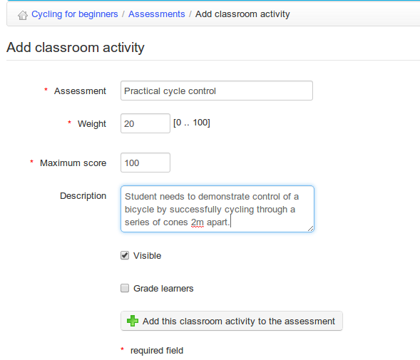
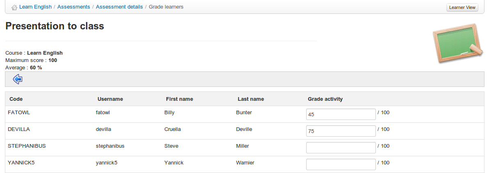

## Adding classroom activities {#adding-classroom-activities}

A “classroom” activity refers to any component of the overall assessment not undertaken inside the Chamilo platform. Any assessed activity can be added a _classroom activity_ and therefore become part of your overall course assessment. As such, you will of course need to add the relevant details manually to the Assessments. To do this, in the main assessment page, click on the _Add classroom assessment_ icon  in the tool-bar.

The name, weighting and maximum score for the activity need to be entered, and the teacher can also choose whether to make the activity visible and whether to grade learners.

*Illustration 105: Assessments – Classroom activity*

You will only be able to add results for classroom activities for learners subscribed to your course. Scoring the Classroom activity is straightforward – click the relevant activity listed in the main _Assessments_ page and then the _edit_ icon  either next to the learner&#039;s listing or (to score a list of learners) in the toolbar:

*Illustration 106: Assessments – Classroom activities – Filling in results*

The scores will be added to the assessment data and included in each student&#039;s grade-book.