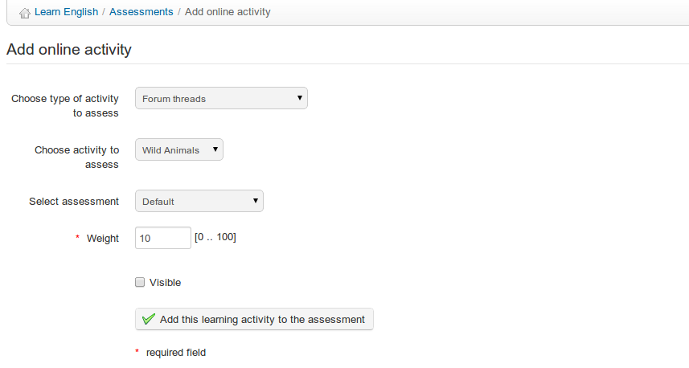

## Adding online activities {#adding-online-activities}

Within the Chamilo course, not only tests but a whole range of activities can be scored and added to the _Assessments_ tool for consideration in the overall grading of students. The _Add online activity_ tool () allows you to create a link from the assessment to one of the following types of resources in your course (these resources already have scoring capabilities):

*Illustration 107: Assessments – Add online activity*

*   Tests,

*   Assignments,

*   Learning paths,

*   Forum threads,

*   Attendances,

*   Surveys

Walk down the drop-down lists to locate the activity visible in the list of activities for this assessment, and click to include the activity in the assessments so that it counts towards the learners&#039; overall grade.

As you might expect, these “online” activities are automatically graded by Chamilo, so you don’t need to give students any score. That’s automatic. But the students will have to take the corresponding activities in order to get their grades.