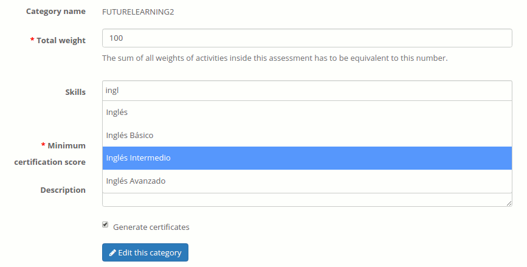

## Linking assessments with skills {#linking-assessments-with-skills}

Since the latest versions 1.9.*, Chamilo allows you to link skills to assessments. In short, anything that would generate a certificate for a user can also be used to grant this student a skill.

This requires the administrator to have enabled and configured the skills available on the platform. This usually requires you to discuss this specific topic with the organization authorities, as you cannot yourself create a skill.

Once skills are available, the administrator will have to come to your course and link the assessment that you have configured with a specific skill. This looks something like this (to the administrator):

*Illustration 118: Assign skill to assessment*

We can see there (although the skills available are written in Spanish) that a new “Skills” field appears in the same edition form as we have for assessments.