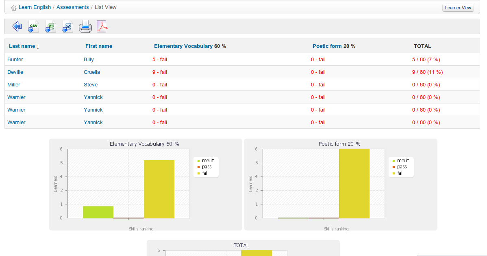

## List view {#list-view}

The list view  view in the _Assessments_ tool allows you to list all learners and their results at any point through the course, as well as charts illustrating students&#039; achievements overall for each assessment and a combined chart for all resources. (This resource is obviously more useful at the end of a course – when students have completed all the assessed activities). The view can be printed or exported in various formats (.xml, .doc, .pdf, .csv) using the relevant tool-bar icons.

*Illustration 115: Assessments – List view*

**Note**: This view only works if skills ranking rules have been fully defined.