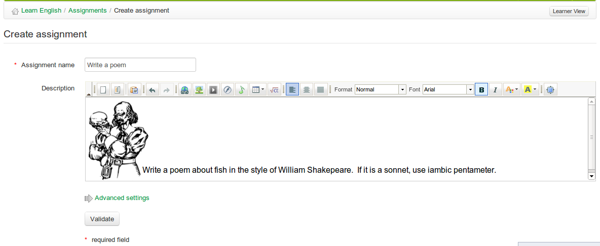

## Assignment creation {#assignment-creation}

To create a new assignment:

*   click on the _Create assignment_tool  in the _Assignments_ page:

*   give your new assignment a name,

*   add a description (optional),

*   click the _Validate_ button.

*Illustration 93: Create a new assignment*

Advanced settings allow you to:

*   Assign a maximum score for the assignment

*   Include the assignment in the assessment/grade-book tool

*   pick a deadline for the assignment to be completed and sent

*   pick a final end date for the assignment (and hide it to students)

*   Include the deadline in the course agenda/calendar.

*   Allow students to hand in their assignment directly from the assignment editor