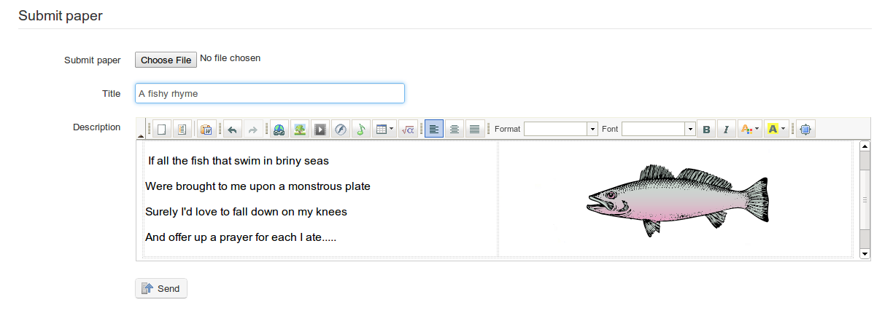

## Completion of assignments by students {#completion-of-assignments-by-students}

Students have the option either to do their assignment on-line or to upload a file or document they have chosen to complete outside of the Chamilo platform (n.b. to ensure students have this choice, the teacher will need to check the relevant box in the advanced settings options of the _Create assignment_ page) The student simply needs to click on the assignment title and then the _submit paper_ icon to be taken to a page where they can upload a file using the relevant tool and/or write their assignment using Chamilo&#039;s rich text editor.

*Illustration 94: Student&#039;s assignment paper*