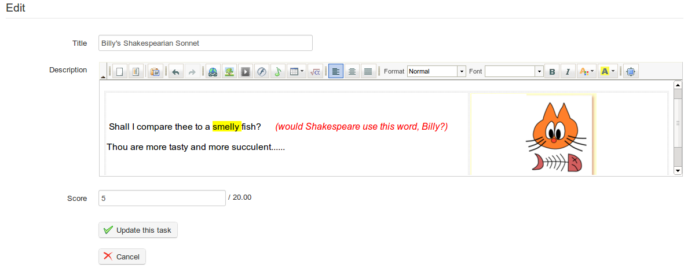

## Marking assignments {#marking-assignments}

To mark a document uploaded by a learner, go to the main page for the relevant assignment. In the right hand column headed _Detail_, click on the _Save_ icon to download and view a file the student has submitted, then click the _Correct and rate_ icon  to add feedback/comments and a score. If the student has not uploaded a file, but submitted their assignment using the on-line editor, the save icon will not show – instead the student&#039;s assignment will be automatically shown in the editor to which the teacher can add feedback etc when scoring the work.

Illustration 98: Marking students&#039; assignments

To save the score/feedback, click the _Update this task_ button.