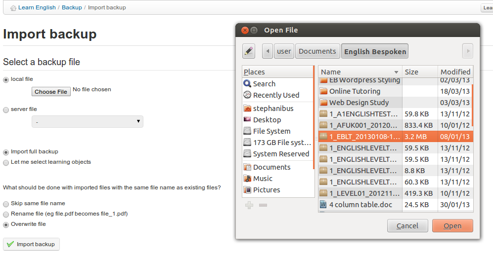

## Import backup {#import-backup}

Each backup is a compressed file (a Zip file) which is stored on the server (in the _archive/_ directory). It can also be downloaded to your computer.

Chamilo also allows you to import the contents of a backup copy inside a new empty course. This can be useful for a teacher creating a new course.

To start the import:

*   click the _Import backup_ link in the _Backup and import_ section__

*   choose the source of backup: either a .zip file on your computer or one stored on the server,

*   choose whether you want to import the whole course or only specific sections (to be selected in the next screen),

*   decide whether to duplicate specific files during the importation operation or to replace them,

*   click _Import backup_ to start the import.

*Illustration 183: Backup - Import*

> **Note** : A message will confirm the backup restoration executed successfully