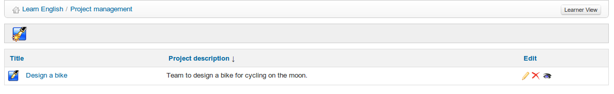

# Blogs {#blogs}

La herramienta _**Blogs**_ fue desarrollada en 2006 a petición de una gran compañía de telecomunicaciones belga. La idea tras ella era implementar un blog con ligeras características de gestión de proyectos, por lo que fue etiquetada con el nombre de _**Blogs inteligentes**_. Su filosofía es la de permitir la asignación de tareas a alumnos, con el fin de que escriban los contenidos de un blog a manera de narración de historias.

El profesor se responsabiliza de elegir los alumnos que participan en el blog, y define el proyecto y la asignación de tareas (o roles tomados por los alumnos). La creación de artículos se comparte entre el profesor y los alumnos.

Sin embargo, esta herramienta se puede utilizar como blog clásico.

> **Nota**: Cuando se crea un nuevo blog, aparece en la lista del curso de Herramientas de autor de la página de inicio del curso. Su visibilidad se puede controlar de igual manera que la de las otras herramientas. Una diferencia fundamental en comparación con el resto de herramientas es que se pueden crear varios blogs dentro de un mismo curso. Aparecerán como múltiples entradas en las Herramientas de autor de forma similar a los Enlaces y Lecciones.

 *Ilustración 175: Blogs - Listado*
