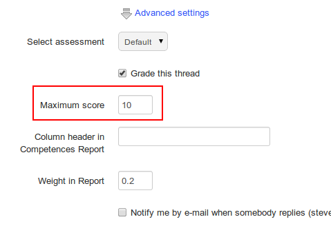
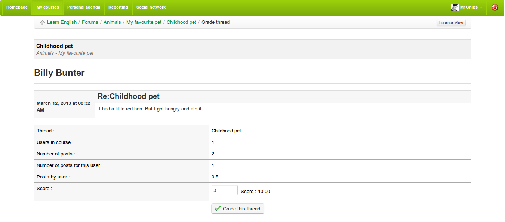

## Give your learners a score {#give-your-learners-a-score}

If you choose to score/grade a topic/discussion thread, you will first need to assign a maximum score to this thread. This needs to be done when the thread is created. Go to _advanced settings_ in the _create thread_ page and check the _grade this thread_ box. An option to enter a maximum score will appear:

*Illustration 72: Assigning a maximum score to a discussion thread*

To score a student&#039;s contribution to a thread:

*   click on the _Learners list_ icon 

*   scroll down to see the list of learners,

*   click on the _grade activity_ icon  next to the learner&#039;s name

*   on the new page, locate the list of all the contributions (messages) written by the learner scored as well as a statistical table based on these same contributions,

*   enter the score you want to assign the learner: with the help of the list of contributions, choose a qualitative evaluation for these contributions. The statistical table allows a quantitative evaluation of the contributions,

*   Click the Grade _this thread_ button.

*Illustration 73: Forum – Marking a thread*