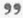

## Quote a previous message {#quote-a-previous-message}

Inside a thread, within a forum, it is often most practical to be able to quote a whole or part of a message. This is the aim of this operation, triggered by the double quote icon. The  answer will be accompanied by the related message to which it is making reference (it will appear in another color in your answer). You can compose a comment etc. as well as edit the quoted text directly.