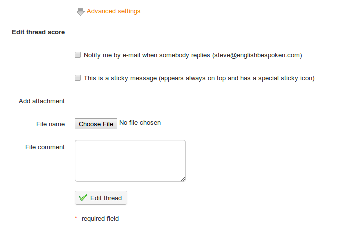

## Start a new topic {#start-a-new-topic}

When the content of a forum is shown:

*   click on the _New message_ link,

*   complete the _Name_ and _Description_ fields,

*   advanced settings allow us to

    *   score a discussion thread as a teacher and give it a maximum score. To do this:

        *   select the “Mark this thread” box

        *   set a maximum score to reflect the learners participation in a discussion thread,

        *   enter or update the title of the corresponding column for the assessments tool,

        *   give a weight to the participation in the discussions thread in comparison to the other components of the assessment tool.

    *   receive e-mail alerts if an answer is added to the discussion thread,

    *   set a discussion thread to appear on top of the threads list,

    *   add an attachment to any message, together with a comment,

*   Click _Create thread_

Illustration 71: Forum – Discussion thread