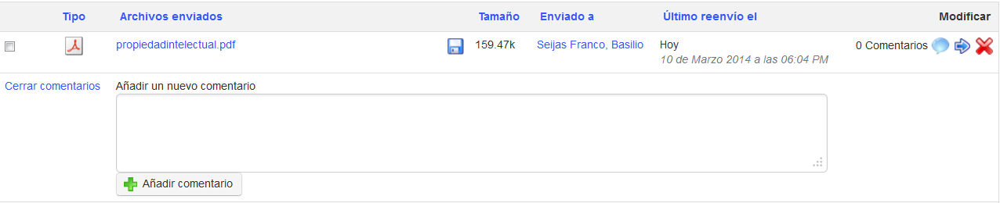

## Leer y agregar comentarios sobre un archivo {#leer-y-agregar-comentarios-sobre-un-archivo}

*    Dar clic en el icono de _**Comentario**_ al costado del nombre del archivo

*   leer los comentarios existentes

*   añadir un comentario en la zona de texto disponible

*   dar clic en el botón “_**Guardar comentario**_”

*Ilustración 160: Compartir documentos - Comentarios*