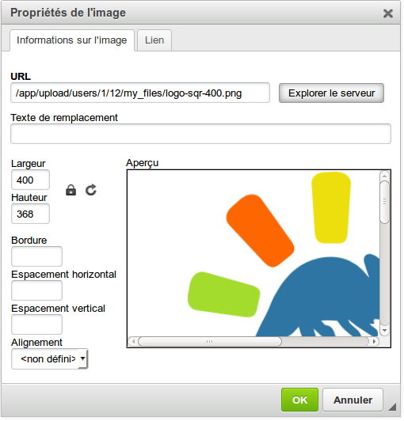

## Gestionar las categorías de un foro {#gestionar-las-categor-as-de-un-foro}

La gestión de las categorías del foro hace uso de iconos familiares:

| Iconos | Características |
| :-: | --- |
|  | Actualizar los ajustes de la categoría del foro |
|  | Eliminar la categoría del foro y todo su contenido |
|  | Controlar la visibilidad de una categoría del foro |
|  | Bloquear / desbloquear una categoría del foro para evitar la edición |
|  | Re-organizar las categorías del foro |

