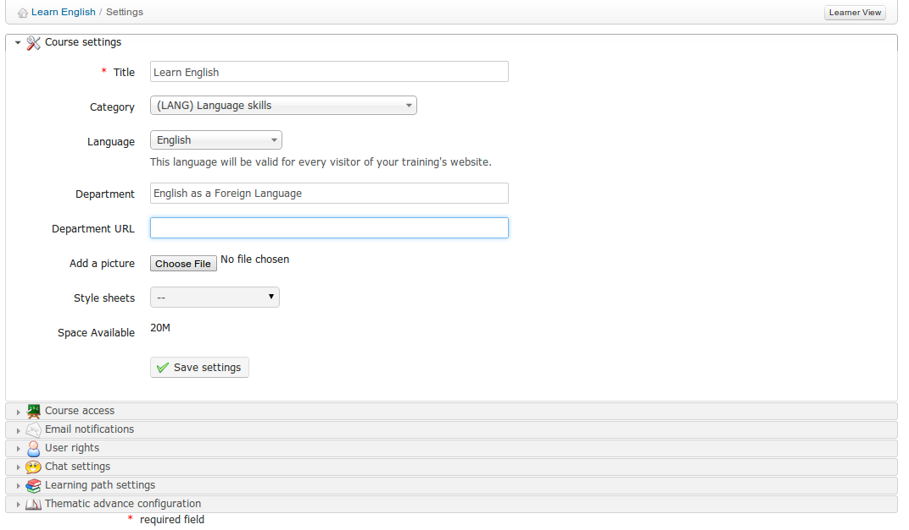
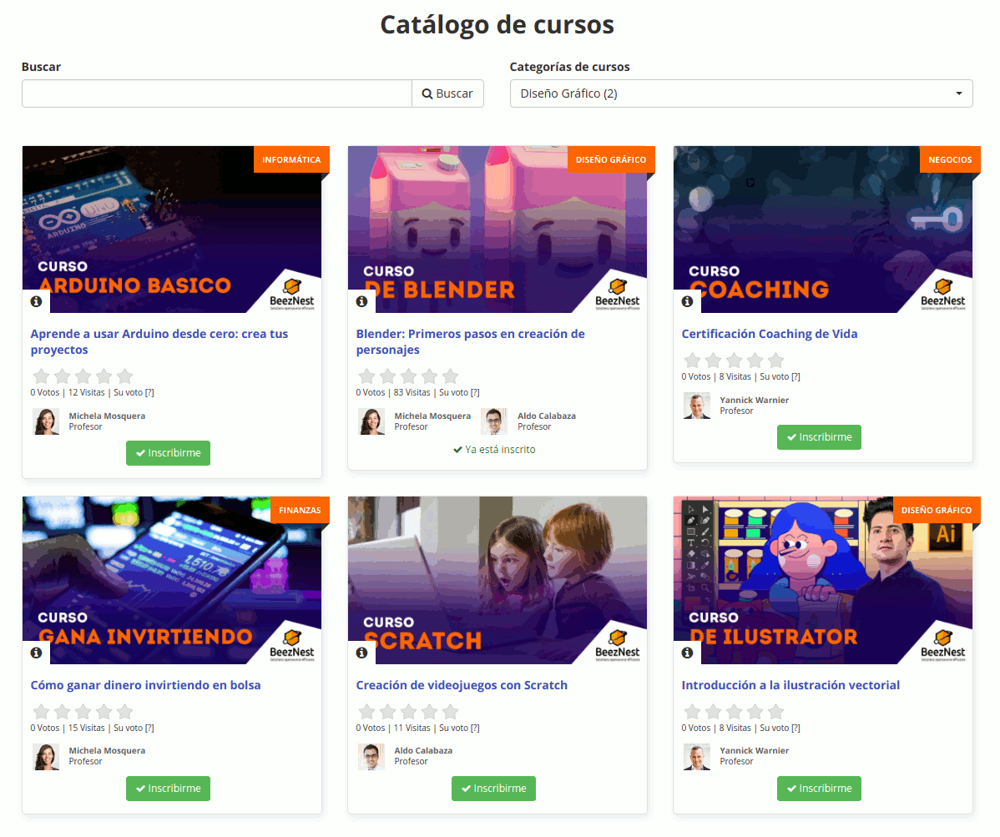

## Actualizar la configuración general de un curso {#actualizar-la-configuraci-n-general-de-un-curso}

Por defecto, esta página (una serie de pestañas verticales), muestra la Configuración del curso principal, en la que puedes:

*   Introducir o editar el título del curso,

*   Establecer o editar la categoría general a la que pertenece el curso,

*   Elegir el idioma en que está establecida la interfaz del curso (que puede establecerse a un idioma diferente de la interfaz de la plataforma, lo que es especialmente útil en cursos de idiomas de “inmersión total”).

*   Introducir un nombre de Departamento y/o dirección web

*   Añadir una imagen que mostrar en el catálogo del curso (importante para publicitar tu curso)

*   Elegir una hoja de estilos para este curso desde un menú desplegable (por defecto, la hoja de estilos de la plataforma)

Ilustración 183: Configuración del curso - General

Ilustración 184: Catálogo de cursos – Ejemplo de imágenes de cursos

**Nota** : el **Departamento** es una característica para la que ya no se ofrece soporte. Dependiendo del estilo visual, puede que el departamento aparezca como enlace en la cabecera del campus (para estilos antiguos). Esto es todo lo que cambiará establecer un departamento. Para versiones recientes de la plataforma a partir de Chamilo 1.8, si necesitas administrar cursos por departamentos dentro de una universidad, recomendamos que utilices la opción de multi-url, descrita en la guía del administrador, la hermana pequeña de esta guía.