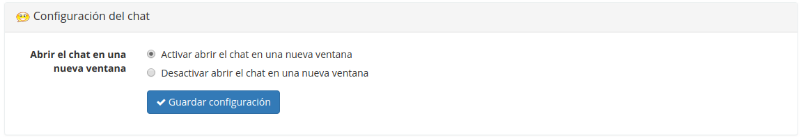

## Configuración del chat {#configuraci-n-del-chat}

En la sección Configuración _del chat_, con la opción adecuada podrás elegir si el chat se abre en la página o en una nueva ventana:

Ilustración 187: Configuración del curso – Configuración del chat