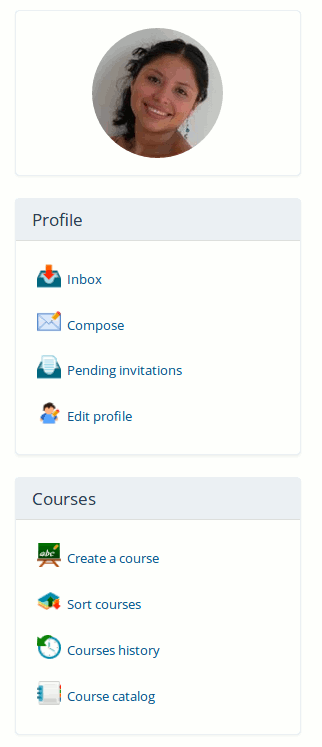
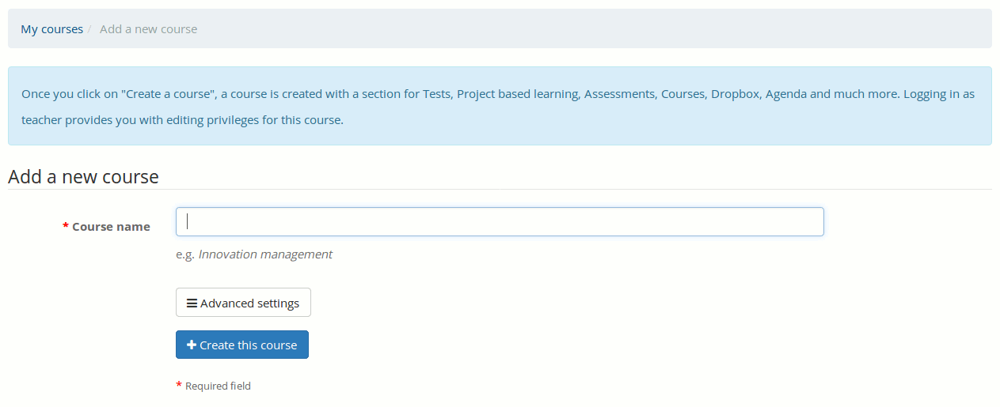
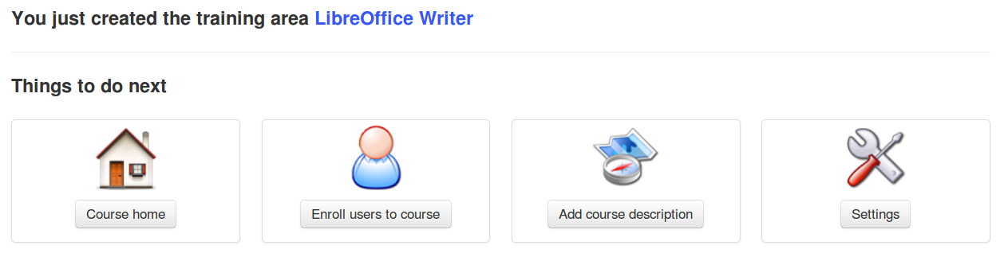

# Course creation {#course-creation}

Illustration 13: Personal menu blocks

Creating a course is quick and easy, and can be done from the _My courses_ page.

Note : on some portals, teachers might not have permissions to create new courses and are simply assigned pre-created courses by the administrator.

Click on _Create course_ in the side column. Fill the mandatory “Course name” field (see Illustration 14: Creating a course – short version) and click the button. That&#039;s it.

The course will be visible by the course creator and (later) by the users subscribed to it. By default, the person who creates the course is responsible for this course&#039;s administration. She is generally referred to as the **Course owner** or **Course creator**.

To create the course, you need only enter a single element, i.e. a clear and detailed title.

Illustration 14: Creating a course – short version

Additional **options** (entirely optional) are available by clicking on the _Advanced settings_button:

*   **a** **category** within the ones offered in the drop-down box[^6] (this is optional),

*   **a** **course code** Pick a code that matches the course title associated with e.g. a numerical classification. (n.b. Even if entered in lowercase, the course code will be automatically uppercased and symbols like _(-, _ and spaces_ will be removed from the code),

*   **the** **course admin** this option is automatically filled with your name and cannot be updated,

*   **the** **language** used to display the course environment (nothing stops you from using e.g. French even if the platform is installed in English). The language choice doesn&#039;t influence the course content, only the course interface[^7]

*   the course can be filled with some **demo content** to indicate to the new course administrator the sort of thing s/he can create inside the course (typically an exercise, forums and an introduction section). Alternatively, this can be left completely empty.

*   finally, the course can be created from a template course that you have access to (you must be a teacher in the template course to see it appear in your list)

Illustration 15: Create a course – extended version

In versions 1.9 and 1.10, a course creation follow-up page was displayed, which suggested:

*   going straight to the newly created course (through a link on the course title),

*   going directly, by clicking on the relevant icon, to one of the most common course configuration steps, as illustrated below.

Illustration 16: Course creation follow-up page

However, feedback has been relatively negative about this feature, so we decided to disable it by default in version 1.11 onward. Your administrator can still enable this if desired.

This empty course structure created, the next step is to enrich this course through the addition of text, multimedia documents, audio tracks, links etc. etc.....)

[^6]: Only the administrator can redefine global courses categories

[^7]: To one exception: if the demo content is enabled, this content is created in the language of the course. Modifying the course language afterwards will have as minor consequence to have the interface in one language and the contents in another.