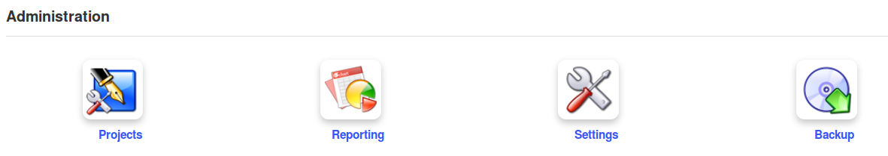

## Administration tools {#administration-tools}

The _administration_ section groups tools that the learner never needs access to – there is therefore no option to hide or show the tools, which are designed for teacher use only.

Illustration 29: Administration tools

### Projects {#projects}

This is where the teacher can create new _blogs_ visible and available to learners in the _Authoring_ section. A blog integrates tasks and users management via a calendar within the _Blogs_ tool, supporting the effective management of collaborative projects.

### Settings {#settings}

Manage the course settings as a teacher. Settings are sorted in a few sections:

|  | Course settings | Manage and update elements such as the course title, category, language, picture, etc. |
| --- | --- | --- |
|  | Course access | Configure course access updates (visibility, subscription and other permissions) |
|  | E-mail notifications | Set the behaviour of for e-mails alerts |
|  | Users rights | Configure of the agenda, announcements or picture display inside the forum |
|  | Chat settings | Configure how the chat tool opens |
|  | Learning paths settings | Enable the graphical theme of the learning path, as well as various other learning path settings |
|  | Thematic advance configuration | Decide whether course progress information should be shown on course homepage |

### Reporting {#reporting}

This important teacher tool tracks learners&#039; use of learning paths, tests, forums etc., as well as time spent on the course, progress, scores, assignments, numbers of messages and last connection date. It is a powerful monitoring tool which can save the teacher a huge amount of time and dreary record keeping work.

### Backup {#backup}

This is where you can (and regularly should!) back up your course by exporting a copy of the course. You can also use it to import previously backed up courses and to delete all or part of the course content and data. You can also use it simply to delete the course – be careful, though – there&#039;s no way back!