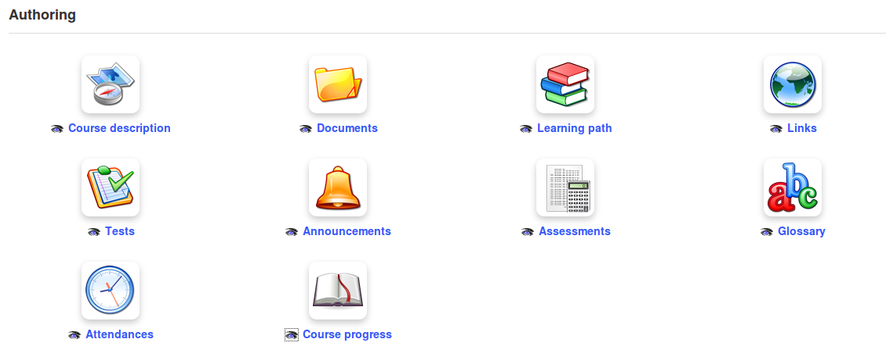

## Authoring tools {#authoring-tools}

*Illustration 27: Authoring tools*

### Course description {#course-description}

The course description is not at all mandatory, but it allows you to present a global summary of the course and to offer potential subscribers a flavour of the course.

The description tool presents several sections which provide the course author with a simple suggested structure for their course description. (The teacher doesn&#039;t have to use these, of course; if the proposed sections do not match requirements, other sections can be created with the preferred titles). The sections include:

*   « Course description »,

*   « Objectives »,

*   « Topics »,

*   « Methodology » etc,

At any time, a section can be removed by clicking on the _Delete_ icon , or updated using the _update_ icon .

The description is available to learners inside the course, but can also be viewed in the course catalog (via the _Description_ button). This button opens a pop-up window showing the description provided by the teacher.

### Documents {#documents}

This is used to add and organize the documents or files (text, images, audio, video, HTML files etc.) used in the course. You can create directories/folders within this tool as required.

### Tests {#tests}

The tests tool is used to create, update or import tests, quizzes and exams in the course. It includes facilities to automatically or manually score and feedback to learners and to track and export learners&#039; results. The tests tool can be used to develop quite sophisticated automated exercises which might in themselves form the core of the course.

### Learning Paths {#learning-paths}

This organizational tool allows you to generate or update **learning paths** to help guide your students through a specific sequence of learning objects/experiences. It can be configured in various ways e.g. to require students to undertake tasks in a given order, or to allow the repetition of certain activities.

Note: If you come from a Moodle background, this feature can be compared to the ordering of blocks on your course homepage.

### Assessments {#assessments}

The assessments tool is very useful when a score has to be assigned for the whole course. It allows for the creation of a gradebook incorporating the results of on-line or in-class evaluations. It also allows for the automatic generation of certificates (although this might not prove as intuitive as the rest of the platform tools due to the many parameters involved).

### Attendances {#attendances}

This provides a means for the registration of attendance by learners, taking this into account in the scoring of assessments.

### Links {#links}

You can use this tool to add links to external websites from within the course which be be of value to students during the course of their study. These links can be incorporated into a learning path.

### Announcements {#announcements}

Use this fully featured tool to make announcements related to the course, which will be flagged up to users when they log in to the course. They can be be personalized and configured to be sent via email to relevant users. It is also possible to attach documents to announcements.

### Glossary {#glossary}

A course glossary can be an invaluable aid to students on some courses. This tool allows you add and view terms and definitions (including sound, graphics etc.) and to import and export text .csv lists or save the glossary as a .pdf file.

### Course progress {#course-progress}

This planning and record keeping tool helps you to create, import, export or save _thematic sections_ which can serve as a “course diary” to include topics and plans and indicate class progress.

> **Note** : The learning paths created inside the course can also be made visible in the « Authoring » section, which could generate redundancy. It is possible to show or hide them using the double square icon in the learning paths list (« Make visible to learners »)

### Blogs {#blogs}

You may not see the Projects tool in the Authoring section, but if you create a project using the tool in the Administration section, it will show up in the _Authoring_ tools, where you can hide it from the learners&#039; view if you wish. This tool allows for collaborative work to be organized.

### Search {#search}

The search tool can only be enabled on the platform by the administrator, as it requires the installation of specific and advanced modules external to Chamilo itself. If enabled, the tool allows for searching within the text of most documents on the whole platform, including texts imported or created inside Chamilo.