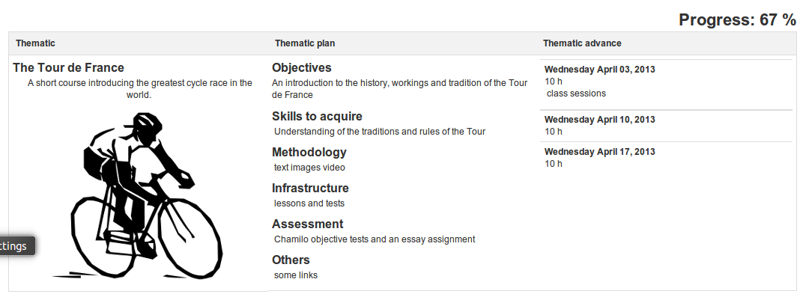
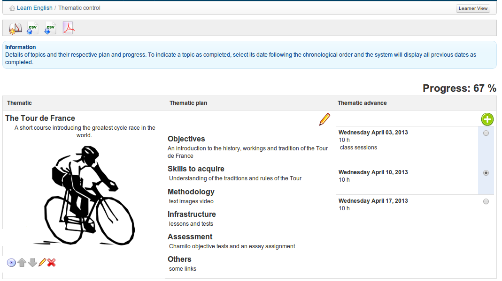

# Course progress {#course-progress}

The _Course progress_ tool  (or perhaps _Course diary_ - the name of this tool is still under consideration) allows the teacher to build a course program to be shown (optionally) on the course homepage to include a progress status relative to the current teachers and learners&#039; progress in the scheduled topic preparation.

Illustration 135: Course progress – Learner view

This tool is only useful in the case of “synchronous” courses, in which the teacher and the learners progress through the course concurrently. Configuring _Course progress_ is quite easy, although quite a lengthy process.

Illustration 136: Course progress – Teacher view