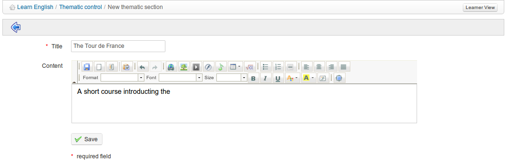
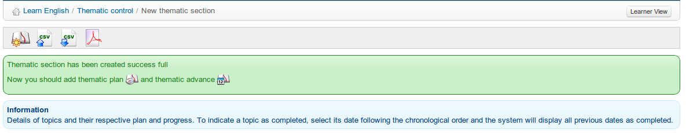

## Create a thematic section {#create-a-thematic-section}

The thematic sections represent the highest level in the course progress&#039; structure. You need to create sections in order to be able to create other levels of the structure.

To create the first section, create the _New thematic section_ icon  and complete the relevant fields using text, images etc.

*Illustration 137: Course progress – invitation to create a thematic plan*

On clicking _Save_ you will be invited to create new thematic plan:

*Illustration 138: Course progress – invitation to create a thematic plan/advance*