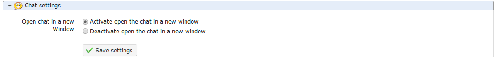

## Chat settings {#chat-settings}

In the _Chat_ section , selecting the appropriate option allows you to choose whether the chat opens within in the page or in a new window:

*Illustration 176: Course settings – Chat settings*