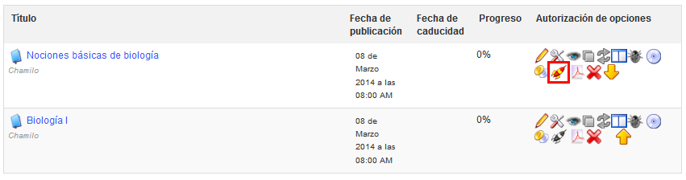

## Learning path settings {#learning-path-settings}

The _Learning path_ section  can be used to enable the _auto-launch_ of learning paths and the style (or graphical theme) for the course.

*Illustration 177: Course settings – Learning path settings*

The auto-launch feature allows the teacher to select one specific learning path to auto-start when the user enters the course homepage. In order to use this feature, you&#039;ll need to enable the option in the course settings (remembering to save the changes) then go to the learning paths list and click on the rocket icon which represents the auto-launch of one of the learning paths:

*Illustration 178: Learning paths - Auto-launch*

Only one learning path can be set as auto-launch at a time, and it will start as soon as the learner enters the course homepage. Other learning paths show a gray rocket icon. To test this option, you&#039;ll have to connect as a learner as it has been disabled for teachers for practical reasons.

As long as the platform administrator has enabled this feature, the teacher can select the _Allow training theme option_ to choose the graphical style of his course. It is also possible to select a separate theme for an individual Learning Path. This means that a learner might theoretically enter his Chamilo campus, see the platform in a particular visual style, (e.g. mostly blue), enter a course and see the style change to red, then enter a learning path and see the style mostly green... For visual comfort, it is recommended, however, to avoid style changes unless they are justified for real pedagogical reasons.

Note : a learner will be able to return to the course homepage from the left menu inside the learning path. The idea here is not to disable or hide the course homepage, but rather to speed access to the course content.