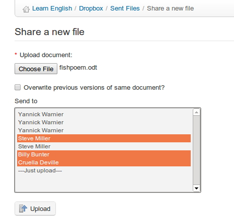

## Send a file to specific users {#send-a-file-to-specific-users}

*   click the _Share a new file_ icon 

*   click the _choose file_ button and select the file on your computer,

*   decide whether to overwrite other files with the same name

*   in the _Send to_ list, select the people to share the document with (groups can also be selected by holding the CTRL key pressed while clicking the names)

*   click the _Upload_ button.

Illustration 146: Dropbox – Sending a file

Files will be listed under the “sent files” tab if they have been uploaded by the user, and under the “received file” tab if the file was uploaded by someone else all files can be instantly accessed by the recipient as well as the sender.