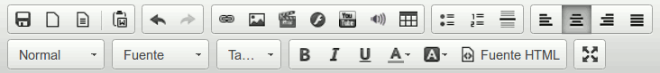
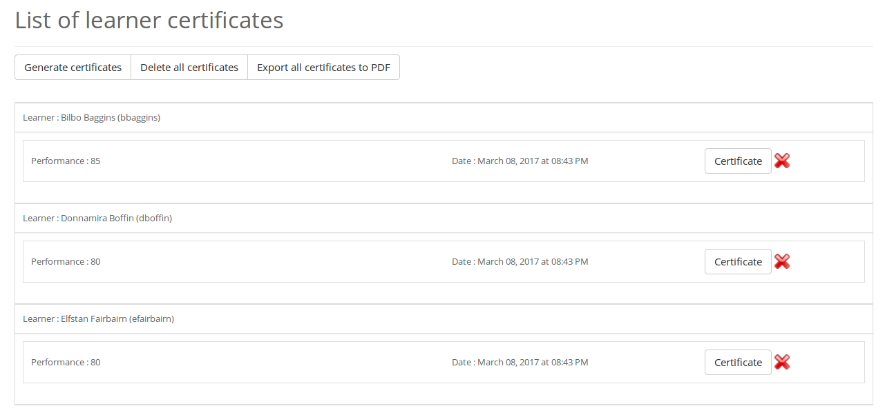

## Ferramentas variables {#ferramentas-variables}

O primeiro elemento importante de coñecer é que a barra de ferramentas do editor WYSIWYG non sempre é a mesma, e é a propósito. Se tiveramos que propor cada vez unhas 30-40 iconas, volvería a interface moi pesada. Por isto, traballamos con docentes no campo para tratar de propor unha primeira visualización que sexa satisfactoria para unha maioría de persoas en cada contexto particular de Chamilo.

Por exemplo, na sección de introdución ao curso, a barra de ferramentas verase como segue.

Aquí atopamos todos os botóns esenciais inmediatamente ao crear a introdución dun curso. Non é (xeralmente) necesario ter opcións como a redacción de fórmulas matemáticas na introdución ao curso.

Sen embargo, conscientes de que existen todo tipo de circunstancias, agregamos un modo “expandido” ao que se accede usando a última icona (4 frechas hacia o exterior) para agrandar a zona de edición á páxina completa **e** ter o espazo suficiente para engadir ferramentas na barra correspondente, como se ve a continuación.

Neste caso, só expandindo a zona de edición, pasamos de 30 iconas de opcións a máis de 45.