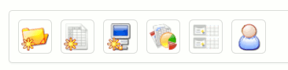
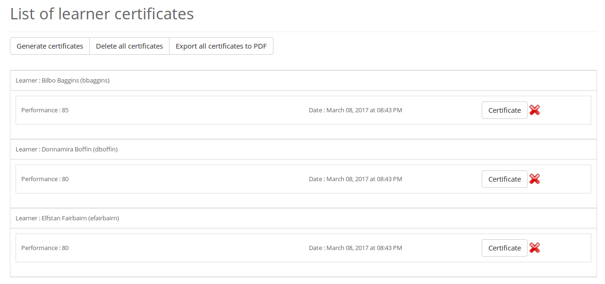

## Herramientas variables {#herramientas-variables}

El primer elemento importante de conocer es que la barra de herramientas del editor WYSIWYG no siempre es la misma, y es a propósito. Si tuviéramos que proponer cada vez unos 30-40 iconos, volvería la interfaz muy pesada. Por esto, hemos trabajado con decentes en el campo para tratar de proponer una primera visualización que sea satisfactoria para una mayoría de personas en cada contexto particular de Chamilo.

Por ejemplo, en la sección de introducción al curso, la barra de herramientas se verá como sigue.

Aquí encontramos todos los botones esenciales inmediatamente al crear la introducción de un curso. No es (generalmente) necesario tener opciones como la redacción de fórmulas matemáticas en la introducción al curso.

Sin embargo, conscientes de que existen todos tipos de circunstancias, hemos agregado un modo “expandido” al cual se accede usando el último icono (4 flechas hacia el exterior) para agrandar la zona de edición a la página completa **y** tener el espacio suficiente para añadir herramientas en la barra correspondiente, como se ve a continuación.

En este caso, solo expandiendo la zona de edición, hemos pasado de 30 iconos de opciones a más de 45.