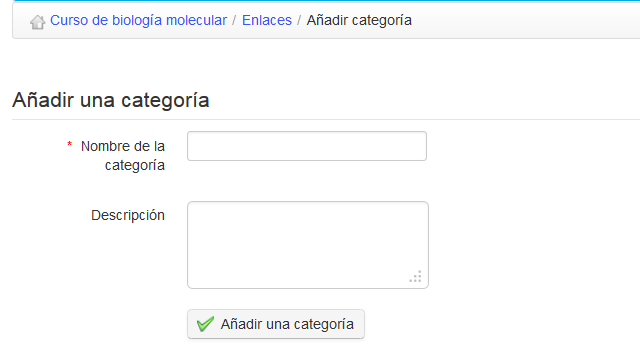

## Categorías de Enlaces {#categor-as-de-enlaces}

Puedes crear categorías de enlaces en Chamilo, permitiendo una mejor estructura cuando tu biblioteca contenga muchos enlaces:

*   Clic en el icono de _Añadir categoría_,

*   Asignar un nombre claro a tu categoría,

*   Añadir una descripción si es necesario,

*   Clic en el botón de _Añadir categoría_.

Ilustración 135: Enlaces – Añadir una categoría