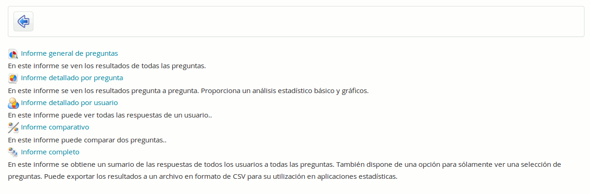

## Resultados {#resultados}

Analizar los resultados de la encuesta puede ser un proceso agotador. Las herramientas descritas en esta sección pueden ser de gran utilidad. Haz clic en el icono _Informes_ para ver un menú con los informes gráficos y estadísticos generados automáticamente; cada uno de los cuales te presentará un detallado informe que puede exportarse como archivo .csv o .xml.

Ilustración 172: Encuestas - Resultados