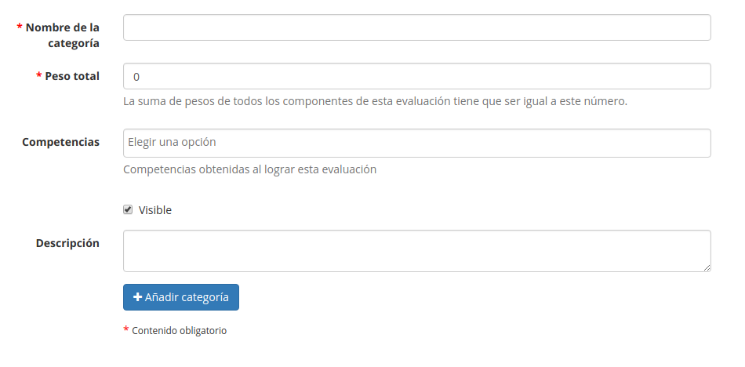

## Gestionar actividades {#gestionar-actividades}

Es posible organizar las actividades incluidas en la página de _Evaluaciones_ rápida y eficientemente utilizando los iconos que se encuentran junto a cada actividad individual:

| Iconos | Funciones |
| --- | --- |
|  | Actualizar la configuración de la actividad (título, ponderación, etc.) |
|  | Quitar una actividad de la evaluación. Las actividades presenciales serán eliminadas, y las actividades en línea serán simplemente quitadas de la evaluación |
|  | Cambiar la visibilidad de los resultados de la actividad en el “libro de evaluación” del estudiante. |
|  | Mostrar el historial de cambios en la configuración de la actividad |

También es posible agrupar componentes de evaluación en de varias “categorías” dentro de la evaluación global del curso. Ten cuidado cuando hagas esto, al asignar las puntuaciones totales y las ponderaciones para el curso en global y para las “categorías”, ¡puede convertirse en un quebradero de cabeza! Para crear una carpeta o categoría, haz clic en el icono de _**Crear evaluación**_ en la barra de herramientas y completa los datos necesarios:

*Ilustración 129: Evaluaciones – crear categorías*

Los componentes de evaluación pueden añadirse a las diferentes categorías mediante la lista desplegable existente en el formulario de creación/edición de cada actividad. La navegación es fácil y rápida entre las categorías y las páginas de _ponderaciones_ y la _vista plana_ .