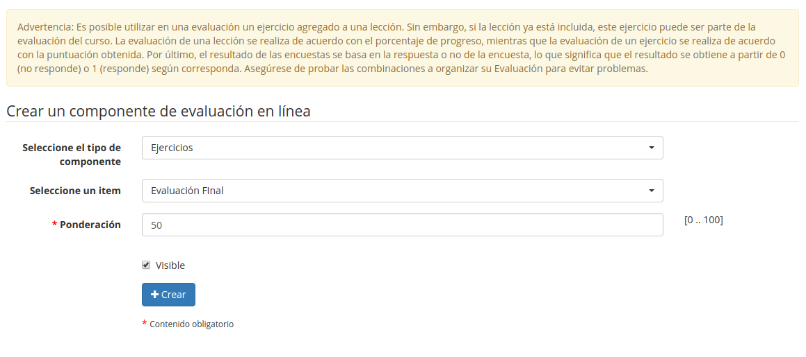

## Añadir un componente de evaluación en línea {#a-adir-un-componente-de-evaluaci-n-en-l-nea}

Dentro de un curso de Chamilo, no sólo los ejercicios sino todo tipo de actividades pueden ser calificadas en la herramienta de _Evaluaciones_ para obtener la valoración global de los estudiantes.

La herramienta de _Añadir un componente de evaluación en línea_  te permite enlazar uno de los siguientes tipos de recursos (estos recursos ya tienen opción de calificación):

Ilustración 127: _Evaluaciones – Añadir componente en línea_

*   Ejercicios,

*   Tareas,

*   Lecciones,

*   Foros,

*   Asistencias,

*   Encuestas

*   Utiliza los desplegables para localizar la actividad entre las disponibles para esta evaluación, y haz clic en “crear”. Se añadirá a la evaluación global de los estudiantes.