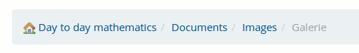
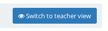

# Finding your way in Chamilo {#finding-your-way-in-chamilo}

Most pages are quickly accessible via the tabs at the top of the page:

*Illustration 9: Chamilo header*

The “tabs” provide access to the homepage, the courses list, your agenda, the reporting/tracking page, the social network and (if you are is lucky enough to be a portal administrator) to the dashboard and administration pages. The last tab shows the user&#039;s picture (so he can check he&#039;s not mistakenly using another user&#039;s account) and a drop-down menu lets the user go to his profile or log out at any time in just two clicks.

Browsing through a course offers the same kind of navigation elements you will find on any computer software. In Chamilo, the very important navigation bar is referred to as the _breadcrumb_ navigation (in reference to a popular fairy tale, the_Little Thumbling_[^5]who saved the lives of his brothers by leaving a trail of stones, then breadcrumbs, in a dark forest so they could find their way home). This type of navigation allows the user to find its way back to his starting point.

The first “breadcrumb” link, on the left, displays the name of the course, and allows the user to return to the course homepage directly. The links to the right of this point directly to the elements of the course in which the user is currently located.

*Illustration 10: Breadcrumb Navigation*

Within a course, _Learner view_ allows the teacher to view the course as a learner. The link then changes to _Teacher view_. Just click the new link to get back to the normal “teacher” view:

*Illustration 11: Switch to student view*

*Illustration 12: Switch to teacher view*

[^5]: Or “Le petit Poucet” in French, see http://fr.wikipedia.org/wiki/Le_Petit_Poucet