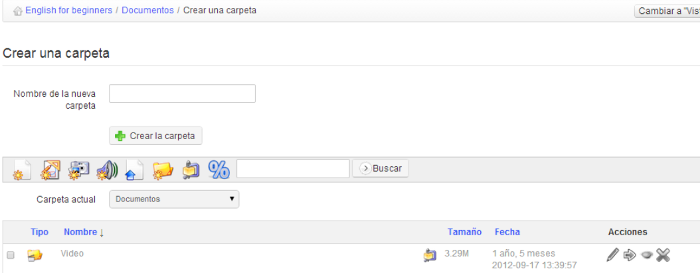

## Create a directory {#create-a-directory}

To achieve a clearer storage structure, Chamilo lets you create directories (folders) and sub-directories by clicking on the folder icon with the yellow star symbol  .

Illustration 30: Documents – creating directories

To create a directory:

*   click on the _Create folder_ icon,

*   enter the directory name,

*   click on the _Create the folder_ button,

*   The new directory has been created and can be used right away to store new documents.

    If you want to create a sub-directory, open the directory you want to create it in and follow the same procedure.