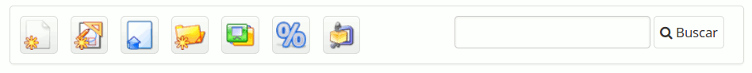
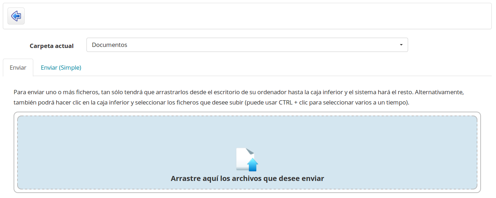
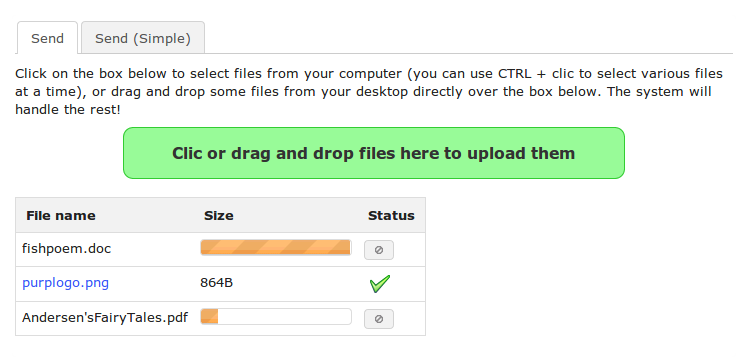

## Importing a document {#importing-a-document}

Import a new document by going to the desired destination folder and clicking the _Upload documents icon_ __.

*Illustration 32: Documents - Icons - Upload*

The following screen appears:

*Illustration 33: Documents – Documents upload*

Click on the green area to explore the files on your disk and select one(s[^8]) to upload. Inside the pop-up window, click the confirmation button. The documents upload starts. If you send several files at the same time, you will see their upload progress, live, as in the following illustration.

*Illustration 34: Documents – Documents upload in progress*

Once the upload is finished, the following validation list appears.

*Illustration 35: Documents – Document upload finished*

The green ticks indicate that the documents have been sent to the course successfully. Click on the blue arrow icon pointing left to get back to the documents list.

> **Note** : The tab labeled Send **(**Simple**)** allows you to use the traditional “dialogue window” procedure to upload. We called it **Simple** because users are generally more used to this one, though it&#039;s really a bit more complicated to use! Document indexing options can only be found in the Simple form (in case your administrator has enabled the search feature) as well as an option to unzip a complete file hierarchy.

[^8]: To select more than one file, use the CTRL key in combination with the left mouse button.