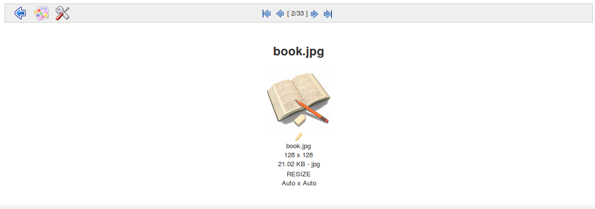
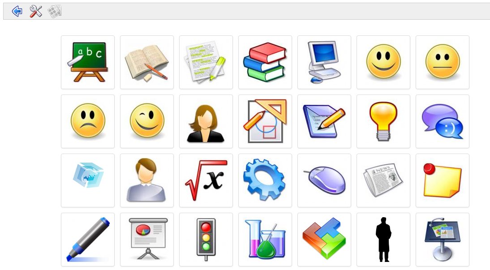

## Slideshow {#slideshow}

If you have a lot of images uploaded in your folders and want to see them all at once, you can use the slideshow feature. Click on the slideshow icon  to go to the folder where your images are located.

You&#039;ll be presented with a type of “slideshow” view of the images in that folder. Each image is captioned with its name, dimensions and size on disk.

*Illustration 42: Image gallery - Slideshow view*

It may be more practical to select the small _show thumbnails_ icon  in the slideshow toolbar to let you view all images at once (as thumbnails), as illustrated below:

*Illustration 43: Thumbnails view*

A _settings_ option is available to further fine-tune the viewing of images.