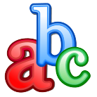

# Glossary {#glossary}

Chamilo integrates a glossary tool  to allow the teacher to define terms or expressions in the same way as a dictionary. No term is defined by default - it is the teacher&#039;s responsibility to define important terms.

Illustration 127: Glossary – Table view