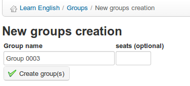

## Create a group {#create-a-group}

On the main _Groups_ page, click the _Create new group(s)_ icon . You will be prompted to enter the number of groups to create (this will speed up the process if you want to create more than one group) and click the _Proceed to create group(s)_ button:

*Illustration 148: Create a group*

Give it a name, enter the number of empty seats you want in the group, and click _Create group(s)_. The new group will appear in the listings in the main _Groups_ page. It can be deleted using the usual _Delete_ icon .

