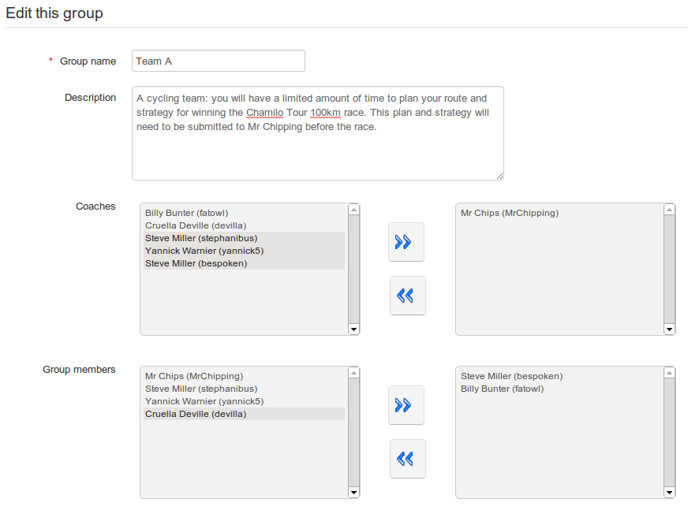

## Fill a group manually {#fill-a-group-manually}

For a variety of reasons, a teacher may want to select group members manually, i.e. choose which learners will work together, e.g. learners with similar interests or goal, or an experienced learner with a latecomer to the course. To do this, (whether or not the groups have already been auto-filled) click the _Edit this group_ icon  to add users manually:

*Illustration 151: Groups – Filling a group manually*

Select and add/remove users as required using the arrows. Any user can be added as a _coach_ (i.e. group leader, tutor etc.) or as a _Group member –_ this will be shown in the listing.