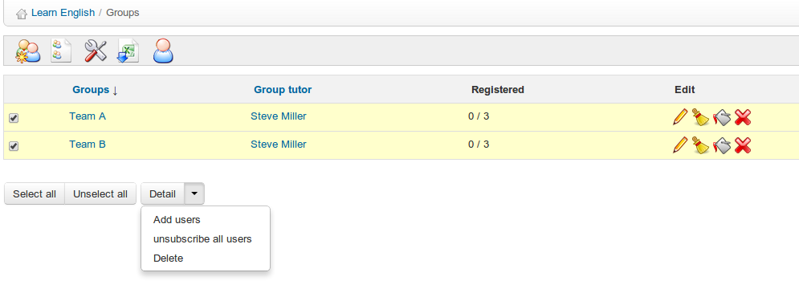

## Auto-llenado de un grupo {#auto-llenado-de-un-grupo}

Para añadir rápidamente usuarios de un curso a un grupo, haz clic en el icono _**Añadir usuarios**_ situado a la derecha del grupo listado en la página principal de _**Grupos**_. Usa el procesado en lotes (menú desplegable situado en la parte de abajo) para llenar automáticamente varios grupos. No podrás configurar los parámetros para el llenado de grupos (por ejemplo, alfabético, aleatorio, etc.) pero siempre podrás editar luego los usuarios del grupo de forma manual. Puedes quitar a todos los usuarios de un grupo haciendo clic en el icono _**Anular la inscripción de todos los usuarios**_ de debajo del listado. Si tienes una larga lista de grupos que gestionar, utiliza las casillas de la izquierda y la opción del procesado en lotes (esto es, el menú desplegable situado abajo) para llenar automáticamente varios grupos:

*Ilustración 163: Grupos – Auto-llenado de grupos*