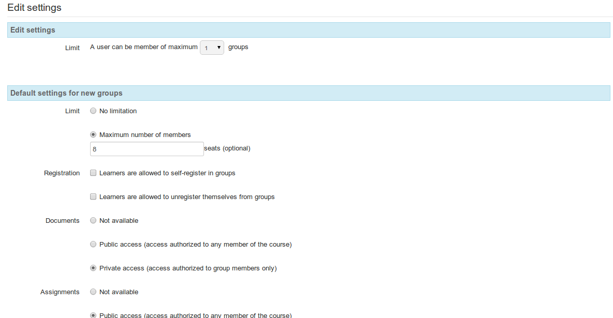

## Parámetros de grupos {#par-metros-de-grupos}

Un profesor puede acceder a los parámetros de grupos desde la barra de herramientas en la página principal de _**Grupos**_. Dar clic en el icono “Editar parámetros”   te lleva a una página que permite limitar la cantidad de grupos a los cuales un único alumno puede pertenecer, y configurar parámetros por defecto para todos los grupos, incluyendo el tamaño máximo de cada grupo, el auto-registro y privilegios de acceso para todas las herramientas asociadas (documentos, agenda, tareas, anuncios, foros, wiki y chat):

Ilustración 162: Grupos - Configuración

Recuerda hacer clic en el botón _**Guardar configuración**_ situado en la parte inferior de la página. Esta configuración por defecto puede ser editada por el profesor de cada grupo utilizando el icono _**Editar** este grupo_, situado a la derecha de cada grupo listado en la página principal.