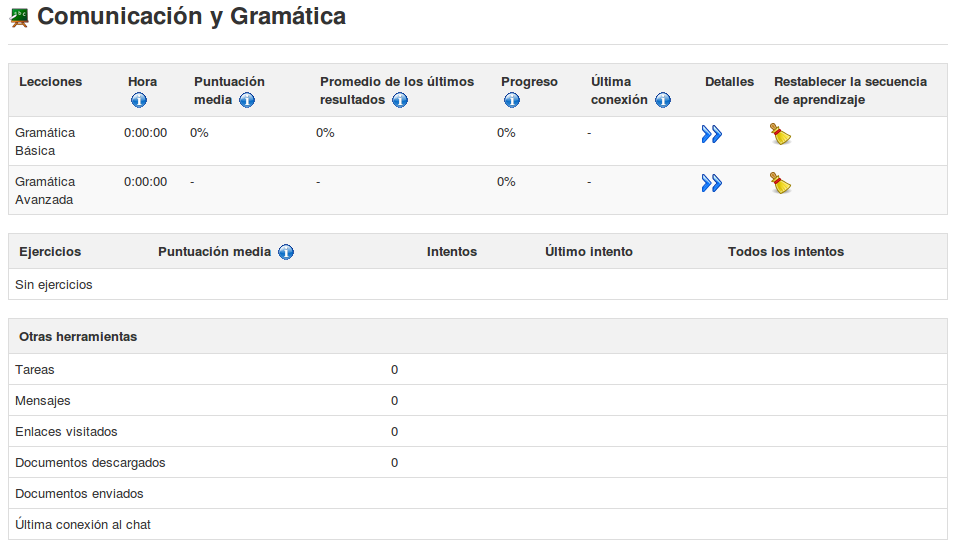

## Mostrar datos individuales de los alumnos {#mostrar-datos-individuales-de-los-alumnos}

En la página _Informes_, hacer clic en el icono _Detalles_  que se encuentra al lado del nombre el alumno que se quiere evaluar. La nueva página muestra los detalles del alumno resumidos, como la información del perfil, foto, detalles de conexión y el resumen del progreso de alumno, además también presenta información detallada del estudiante sobre cada lección, resultados de los tests, y la información potencialmente útil sobre otras actividades como pueden ser: las tareas, mensajes enviados, enlaces visitados, documentos subidos y chat.

*Ilustración 102: Informes – datos individuales de los alumnos*

La información se puede imprimir  , exportar como un archivo csv  o enviar por correo-e 

haciendo clic en el icono correspondiente de la barra de herramientas en la parte superior de la página.

Pulsando en el icono _Detalles de acceso_  en la barra de herramientas, permite al profesor ver el curso (horas y fechas). Esta pantalla de información general da una idea general de la participación del alumno, lo que puede ser útil para evaluar la participación del estudiante en el curso

*Ilustración 103: Usuarios – Detalles de acceso*