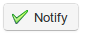

## Seguimiento de los alumnos {#seguimiento-de-los-alumnos}

Por defecto, al pulsar sobre el icono _Informes_ se mostrará una lista de los alumnos del curso con un resumen detallado de sus actividades. Se incluye información detallada sobre puntuación alcanzada en los ejercicios, tiempo de permanencia en linea, nombre de usuario, etc.

Ilustración 101: Informes – Alumnos

En esta página, el profesor, puede ver una tabla resumida de la actividad general de los estudiantes y su progreso. También puede añadir fácilmente columnas a la tabla general referentes al perfil de los estudiantes (país, data de nacimiento), así como otros datos del curso relativos a los mismos ( código de curso, datos de rendimiento, tareas, mensajes, encuestas).

El profesor puede poner de relieve  los estudiantes ausentes durante un periodo de tiempo determinado (determinado por el docente) y con un solo clic notificárselo a los alumnos con un anuncio apropiado, usando la herramienta de anuncios configurable (ver capítulo 21), a la cual se accede pulsando sobre el botón de notificación  . El profesor también puede imprimir la tabla  o exportarla como un archivo csv .