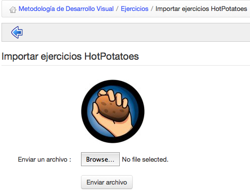

## Créer un Exercice {#cr-er-un-exercice}

Cliquez sur « Nouveau test » et donnez-lui un nom. Vous pouvez en rester là et passer à la page suivante, mais ici nous vous demanderons d&#039;étendre le formulaire en cliquant sur le bouton « Paramètres avancés ».

Illustration 40: Exercices - Création d&#039;un test - Options avancées

Les autres paramètres sont facultatifs, mais ils permettent de préciser quelques conditions :

*   l&#039;icône « médias associés » permet d&#039;associer un média (texte, son, image, etc.) à l&#039;aide de l&#039;éditeur interne, cette information apparaîtra au début du test,

*   donner un « Feedback » ou non aux apprenants,

*   le mode d&#039;affichage des « Questions par page »,

*   choisir de « Montrer le résultat (du test) à l&#039;apprenant » ou non,

*   définir si utiliser un « Ordre des questions aléatoire »,

*   définir si mélanger (ou non) les réponses au sein des questions à choix multiple,

*   permettre la catégorisation des questions en catégories différentes et leur sélection aléatoire **par catégorie** pour les examens,

*   limiter le nombre des tentatives,

*   limiter le test dans le temps permet de lui donner une date de début et une date butoir où il ne sera plus accessible,

*   choisir de propager les scores négatifs d&#039;une question à une autre, ou de définir le minimum pour une question comme étant « 0 »,

*   « activer le contrôle du temps » permet d&#039;afficher un compteur dégressif du temps restant durant l&#039;exercice.

*   définir si les apprenants pourront réviser leurs réponses avant de finaliser l&#039;examen,

*   définir un pourcentage limite considérer comme « succès » à l&#039;examen,

*   définir un message de fin d&#039;exercice

Ensuite « Poursuivre avec la création de questions » pour ajouter la première question au test.

**Note** : _la combinaison de_ **_feedback immédiat_** _avec le mode_ **_auto-évaluation_** _donne accès à un type d&#039;exercice adaptatif assez différent du reste, qui n&#039;est pas couvert dans ce guide._