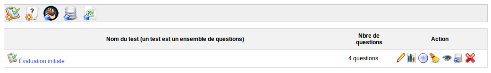
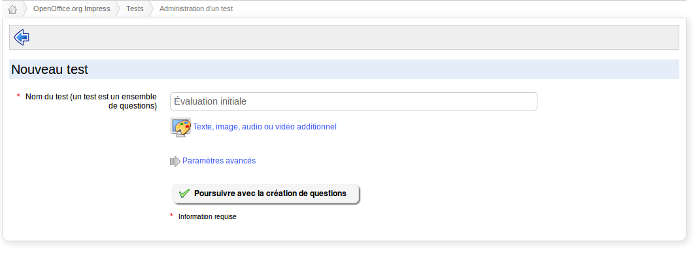

## Introduction {#introduction}

L&#039;outil d&#039;exercices est généralement la seconde incursion des enseignants classiques dans le monde de l&#039;e-learning.

L&#039;intérêt est clair : correction automatique des réponses des étudiants (donc économie de temps pour l&#039;enseignant qui peut dès lors se concentrer sur la qualité des questions), possibilité pour l&#039;étudiant de s&#039;auto-évaluer de façon répétée, sans dépendre de la disponibilité de l&#039;enseignant (ses résultats lui sont affichés automatiquement), réutilisation de questions d&#039;un cours à l&#039;autre, etc.

Un exercice bien élaboré peut constituer un outil d&#039;une valeur inestimable pour augmenter la motivation des apprenants. L&#039;enseignant peut définir des suggestions et commentaires pour la rétro-alimentation des apprenants, aussi détaillé que nécessaire, au travers de liens, de vidéos, etc.

L&#039;outil d&#039;exercice pourrait aussi bien être appelé outil d&#039;examens, puisqu&#039;il permet de générer des examens limités en temps, avec tirage aléatoire au sein d&#039;une banque de questions, etc.

L&#039;outil vous permet de créer ou d&#039;importer un questionnaire (au format [HotPotatoes](http://fr.wikipedia.org/wiki/Hot_Potatoes), IMS/QTI2 ou XLS).

Illustration 38: Exercices - Liste

La création d&#039;un nouveau test est très simple. Cliquez sur la première icône à gauche et donnez-lui un titre, puis cliquez sur le bouton de confirmation.

Illustration 39: Exercices - Création simple

Comme il existe une grande quantité de types d&#039;exercices différents, vous pourriez penser que les options par défaut que nous avons choisies ne vous conviennent pas entièrement. Qu&#039;à cela ne tienne, l&#039;option dépliante de _Paramètres avancés_ est là pour ça (voir Illustration 40 ci-après).

Ce questionnaire comporte de nombreuses options. Lors de la création du test (et aussi lors de son édition), vous pourrez choisir :

*   le temps limité ou illimité (_contrôle du temps_) – un décompte en temps réel apparaîtra à l&#039;utilisateur[^7],

*   le nombre d&#039;essais du test, indéfini ou limité,

*   si toutes les questions vont sur une page, ou seulement une question par page (dernière option recommandée pour des questions de suivi),

*   l&#039;ordre des questions (aléatoire ou non),

*   etc.

Les questions posées peuvent être de différentes nature :

*   choix multiple,

*   réponses multiples,

*   remplir les blancs ou le formulaire (ou encore mots-croisés en se basant sur une table remplie de blancs),

*   apparier,

*   question ouverte,

*   zones sur image,

*   combinaison exacte,

*   apparier par glisser-déplacer,

*   réordonner des mots dans une phrase,

*   sélection d&#039;image,

*   question calculée

… ainsi que quelques variations sur ces types de questions.

Les réponses à ce questionnaire sont rentrées lors de sa création, puis la correction est réalisée dans l&#039;onglet « Résultats et corrections » lorsque les apprenants l&#039;ont effectuée. Cet onglet leur permet aussi d&#039;ajouter un commentaire puis d&#039;exporter les résultats obtenus.

Un exercice rassemble un certain nombre de questions, pas nécessairement du même type, sous un thème commun.

[^7]: Si l&#039;apprenant se déconnecte, son temps continuera d&#039;être décompté jusqu&#039;à ce qu&#039;il s&#039;écoule entièrement, mais il pourra se reconnecter et continuer son exercice là où il l&#039;avait laissé. Le décompte du temps ne fonctionne que dans le mode une question par page.