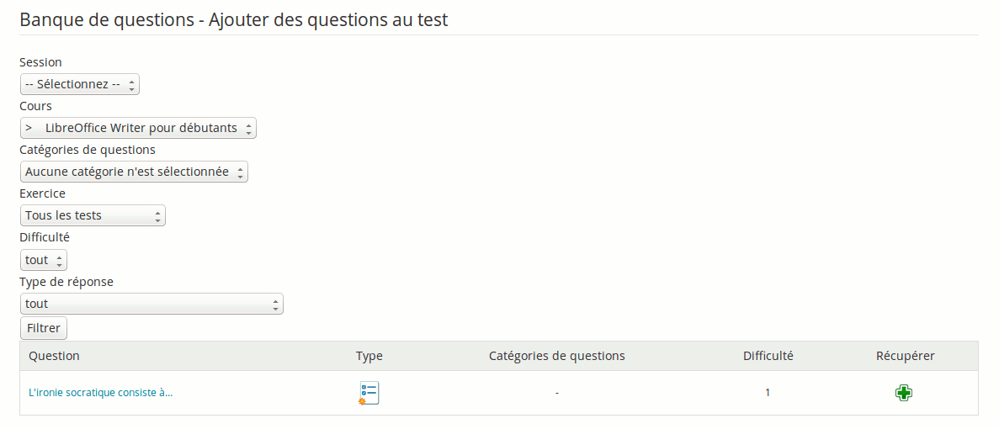

## La banque de questions {#la-banque-de-questions}

Toute question créée, indépendamment du test ou du cours auquel elle est initialement rattachée, alimente la base de questions. Cette base peut servir de « réservoir à questions », en cas de manque d’inspiration...

Lors de la création d’un test, la base présente les questions des autres tests ainsi que les questions orphelines (c&#039;est-à-dire les questions ayant appartenu à un test supprimé).

Lorsque la base de questions s’affiche, elle présente la liste de toutes les questions existantes dans le cours. À l’aide des listes déroulantes « Filtre » et « Difficulté », ne s’affichent que les questions attachées à un exercice donné et d’un niveau donné.

Illustration 44: Exercices - Banque de questions

Cliquez sur le bouton « Récupérer » pour récupérer immédiatement la question dans l&#039;exercice.

Depuis la version 1.8.8, l&#039;enseignant peut récupérer des questions depuis d&#039;autres cours qu&#039;il enseigne.
