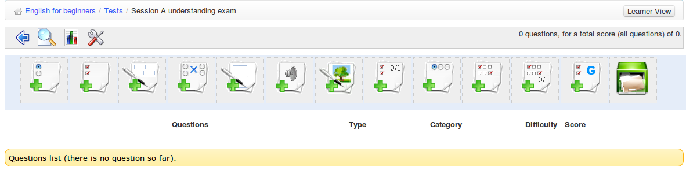

## Adding questions to the test {#adding-questions-to-the-test}

On creating a test, click _Proceed to questions_ you will be taken to the questions page:

*Illustration 47: First view of the questions list*

In addition to the toolbar the page displays an array of different types of question. (The same page can be accessed at a later time using the edit icon for any given test listed in the _Tests_ page.) It offers a range of question types from which to choose, which are described in this section. Each test can contain a combination of question types – this can prove handy for ensuring tests don&#039;t become monotonous.

Fill banks/form

multiple choice

Open question

image zones

Unique answer + unknown

Combination T/F/ ?

multiple answer

matching

Oral expression

exact selection

Multiple answer T/F/ ?

Global multiple answer

*Illustration 48: Exercises – Question types*

Questions are created using an on-line form which differs according to the question type. The following subsections describe each form in detail. Completion of the forms is quite intuitive. The following general points regarding the completion of the on-line forms apply to all or most types of question:

1.  The “Comment” column will only be shown if you selected the _show feedback_option to in the _advanced settings_ when you created the test (if you don&#039;t want to show any feedback, then there is little point in showing this column on the page.)

2.  Any fields marked with a red asterisk * must be completed.

3.  Every question has a title and an “enriched” description. We generally recommend putting a short title in the title box, and putting the **real** question in the _enrich question_ box. This will allow you to present a much fuller, more meaning question, use images, and/or include audio or video.

4.  All answer and comment boxes have editing tools which are hidden by default but can be viewed by clicking the small black arrow on the top-left corner of the text box. This will allow you also add images, links and audio to your answers or feedback comments.

5.  Every question type involves the **allocation of scores**. In the case of questions requiring scoring later by a teacher, this will simply be a maximum score against which the teacher will mark the test. In the case of objective tests involving learners selecting an answer, the score for each right or wrong answer chosen can be set, and can include negative values. Teachers should give some thought, particularly in tests involving different question types, to what weighting within the overall test each question should carry.

6.  Teachers should also consider the number of options they wish to offer in the case of multiple choice type questions – this can be determined using the red and green _remove/add_ _answer option_ buttons at the foot of the form.

7.  If you have a lot of questions covering several topics, you may find it useful for organizational reasons to assign individual questions to categories in the _advanced options_ – particularly if you plan to recycle questions. (You need to create the categories first of course, choosing the _create category_ option  on the main test page. This allows to create a **category** with a description which will appear in a drop down list.) Using categories is optional but we would strongly advise you do so if you have any number of questions, for sake of future editing or recycling of questions.

8.  You can also assign a **difficulty level** for each question in the _advanced options._ This can be handy for later fine-tuning the evaluation of students&#039; work, or reviewing the test overall. It can also be very useful when it comes to recycling questions, allowing you filter questions by difficulty.

### Type 1 : Multiple choice – Single answer {#type-1-multiple-choice-single-answer}

The classic multiple choice question is one in which **only one answer** can be considered valid for scoring purposes. It is possible to make the test a little bit more challenging by assigning a negative score to a wrong answer. When this is highlighted (e.g. in the test introduction or the question itself), this encourages the learner to think more carefully before selecting ananswer at random, and incurring a penalty.

*Illustration 49: Tests – Multiple choice, single answer*

### Type 2 : Multiple choice – multiple answer {#type-2-multiple-choice-multiple-answer}

This question type is a variation of the previous simple multiple choice question. It allows you to assign more than one valid answer. Again, positive and negative scores are possible. This type of question can prove more challenging to students (you may wish to indicate in the question that there are two answers – so as not to “trick” them!

Illustration 50: Tests – Multiple answer question

### Type 3 : Fill the blanks {#type-3-fill-the-blanks}

This question type can be used to produce the classic “cloze passage” exercise favoured by language teachers, in which certain words in a written passage can be selected to be displayed as a blank field for students to fill in. First, the teacher simply needs to type the passage (or list of sentences) and then add square brackets around the words to be “blanked”. (These words will be displayed to the learner as empty text fields, which will be marked as correct if the student enters the correct answer matching the word typed by the teacher.) As soon as the square brackets are added, the form will display a “score” field for each word to be corrected. To make the test a little easier, the teacher may choose to list the words to be chose in the “enrich question” box. It&#039;s a handy test for checking key terminology or vocabulary.

*Illustration 51: Tests - Fill the blanks*

The question will appear like this to the learner, who simply needs to type the correct word in to the blank fields:

### Type 4 : Matching {#type-4-matching}

This type of question is designed to have the learner link together text elements from one list with text elements in another. An element might be a word, a sentence or part-sentence. It can also be used to ask a user to sort elements in a certain order.

*Illustration 52: Tests – Matching text elements*

The learner will view the matching question like this:

or, from 1.9.6, a draggable circle will make it a little more appealing to students.

### Type 5 : Open question {#type-5-open-question}

The open question type allows the learner to write whatever they wish as an answer (a kind of “mini-assignment). As such an activity has no single give answer, it will **not** be automatically evaluated at the end of the test, but will have to be evaluated manually by the teacher before the final test result can be scored. As with assignment and marked forum posts, the teacher is able to do this via the _Recording_ tool which will flag up open questions needing marked.

*Illustration 53: Tests - Open questions*

The learner will be presented with a text field in which to write. (He can use the small arrow on the left of the top border of the field to make use of a range of fields if he wishes to enrich his presentation. e.g. with heading or highlighted text.)

### Type 6: Audio answer {#type-6-audio-answer}

This new question type, available with Chamilo 1.9, will only appear only if your administrator has enabled the Nanogong audio recording feature. The question can be compared to “open question” type described above, requiring manual marking by the teacher, but instead of asking the learner to write a text passage, you ask him to record an audio answer. This has obvious uses for language courses, of for learners with particular access needs, but can provide a useful alternative in many study fields – encouraging learners to develop their oral presentation skills.

(note: This question type requires the learner to have Java applets supported in his browser. If this is not the case, he will need to to record the audio separately and then upload it as an MP3 file to the server.)

Because of the additional requirements for this question type, you should make sure your learners are aware that the test will contain an audio question and that they have a more than one chance to try the test to check whether their browser supports it or not. (Bear in mind that taking a test is generally a stressful experience. You don&#039;t want to give your learners a nervous breakdown because they can&#039;t manage to record an audio answer!)

*Illustration 54: Tests – Oral expression*

The learner simply needs to press the _Record answer_ when he is ready to talk, and follow the instructions for the on-screen Nanogong recorder, which will automatically send his recording to the teacher for marking and scoring.

### Type 7 : Hot spot, or image area {#type-7-hot-spot-or-image-area}

In this type of question, the learner will be asked to identify areas within an image by clicking on them. These areas have been previously defined by the teacher. Building one of these questions require slightly more work than other types.

*Illustration 55: Exercises - Hot spot question creation*

Having uploaded your image and named your question, you can add or remove hotspots, and define the area using an ellipse, a rectangle or a polygon shape. As with other question types, you can add comments for feedback purposes and determine a score for each correctly identified area.

The learner needs to click on the picture to identify the areas listed – the numbers will appear on top of the areas on which he clicks:

*Illustration 56: Exercises - Hot spot learner view*

### Type 8 : Exact combination {#type-8-exact-combination}

This is a variation of the multiple answer type test looked at above. The only difference is that no partially-correct combination will be accepted. This means that if, between options A-B-C-D, only B and D are correct, you will have to mark both B **and** D in order to be given the points assigned to this question. There is therefore only one overall score field shown on the form.

*Illustration 57: Tests - Exact combination*

### Type 9 : Unique answer with unknown {#type-9-unique-answer-with-unknown}

Sometimes a teacher wants the student to indicate that they don&#039;t know the answer to a question, rather than just guess an answer. This question type is a single-answer multiple choice question, but reserves the last answer as a “Don&#039;t know” option, with an automatic score of zero. Students can be discouraged from guessing by penalizing a wrong answer with a negative score.

*Illustration 58: Tests – unique answer with unknown*

### Type 10 : Multiple answer True/False/Don&#039;t know {#type-10-multiple-answer-true-false-don-t-know}

This is a another combination format which includes a zero-scored “don&#039;t know” option as with the above question option, but using true/false answers rather than multiple choice. Again, negative scores can be assigned to discourage guessing, and admit “honest” ignorance!

*Illustration 59: Tests – Multiple answer true/false/don&#039;t know*

### Type 11 : Combination True/false/don&#039;t know {#type-11-combination-true-false-don-t-know}

This option offers a single score covering one or more questions. The form looks similar to the “exact answer” form, but the test is displayed to the student differently, as illustrated below.

*Illustration 60: Tests – Combination true/false/don&#039;t know*

The learner will view the question(s) and use radio buttons like this:

> **Note**: a “don&#039;t know” will generate a zero score, so this format might most fairly contain one or two questions – requiring prudent use from the teacher.

### Type 12 : Global multiple answer {#type-12-global-multiple-answer}

This question format combines the multiple answer format with a single score , providing an option for ensuring that no negative score is accrued

*Illustration 61: Tests – Global multiple answer*