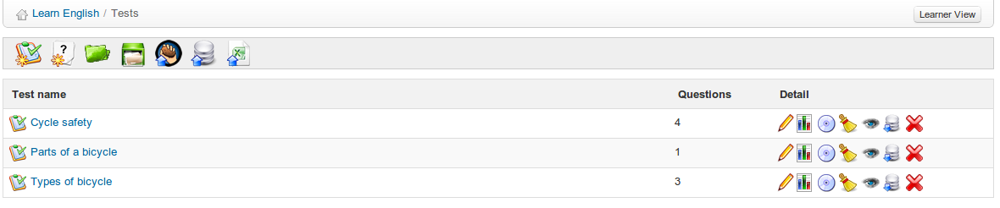
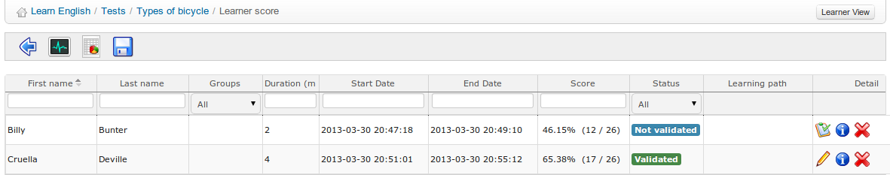

## Test results {#test-results}

Chamilo offers handy support for analyzing test results simply by clicking on the _Results_ icon , displayed to the right of each test listed in the main Tests page.

*Illustration 65: Exercises - List*

This will display a page listing all the results for the relevant test.

*Illustration 66: Exercises – Results list*

Here, the teacher can get an overview of learners&#039; times and scores, and can score  or edit  open questions and offer feedback. He can also delete  a test attempt to allow the learner to do the test again (if there is a valid reason to do so e.g. there was an error in the test).

The menu bar of this page allows the teacher to navigate back  to the test , export test results in CSV or XLS format  (e.g. to sort them and generate graphical evaluation statistics), view statistics  about test questions undertaken or even monitor students taking the test “live” to know how they are performing “during” the exam (particularly useful to monitored exam centers).