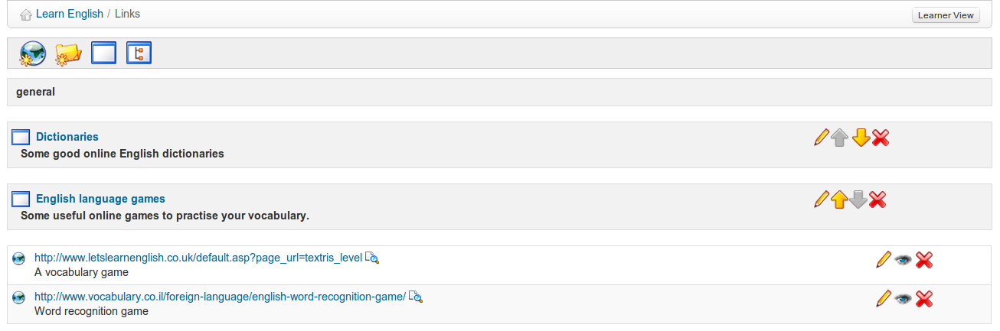

# Links {#links}

The Li_nks_ tool  allows you to create a library of internal and external links which learners can use in a course as they work their way through the learning path.

Illustration 121: The Links page