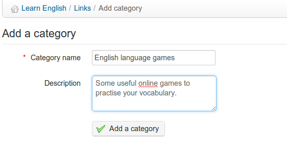

## Links categories {#links-categories}

You can create links categories in Chamilo, allowing for a better organizational structure when your library contains a lot of links.

*   Click the _Add a category_ icon ,

*   Give a clear name to your category,

*   Add a description if needed,

*   Click the _Add a category_ button.

*Illustration 122: Links - Add a category*