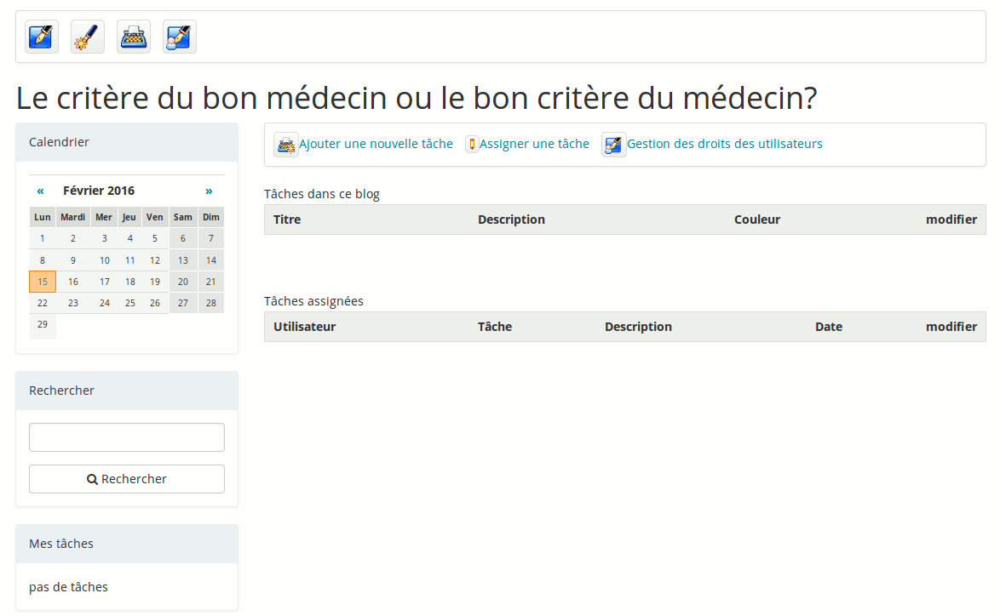
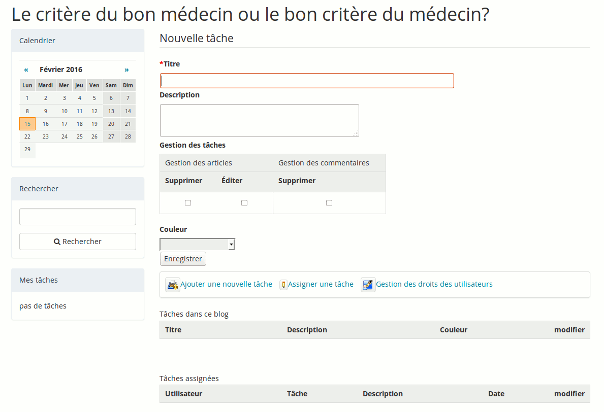

## La gestion des tâches (ou définir des rôles)

Le lien « Gestion des tâches » est utilisé pour créer des tâches détaillées d’une étape de projet ou affecter des rôles aux participants du projet/blog.

Illustration : Blogs – Liste des tâches

Pour créer une nouvelle tâche (ou un nouveau rôle) :

*   cliquez sur le lien « Gestion des tâches »,

*   cliquez ensuite sur le lien « Nouvelle tâche »,

*   donnez un nom à la tâche,

*   décrivez-la éventuellement,

*   affectez une couleur à l’aide de la liste déroulante,

*   « Enregistrer ».

Illustration : Blogs - Nouvelle tâche

→ La nouvelle tâche vient enrichir la liste des tâches existantes.
