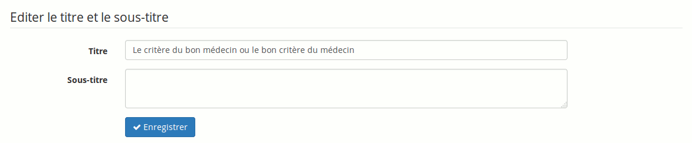

## Lancer un nouveau projet {#lancer-un-nouveau-projet}

Depuis la page d’accueil de projets :

*   cliquer sur le lien « Créer un nouveau blog »,

*   lui donner un nom,

*   décrire éventuellement le projet,

*   « Enregistrer le projet ».

Illustration 177: Blogs - Création d&#039;un blog